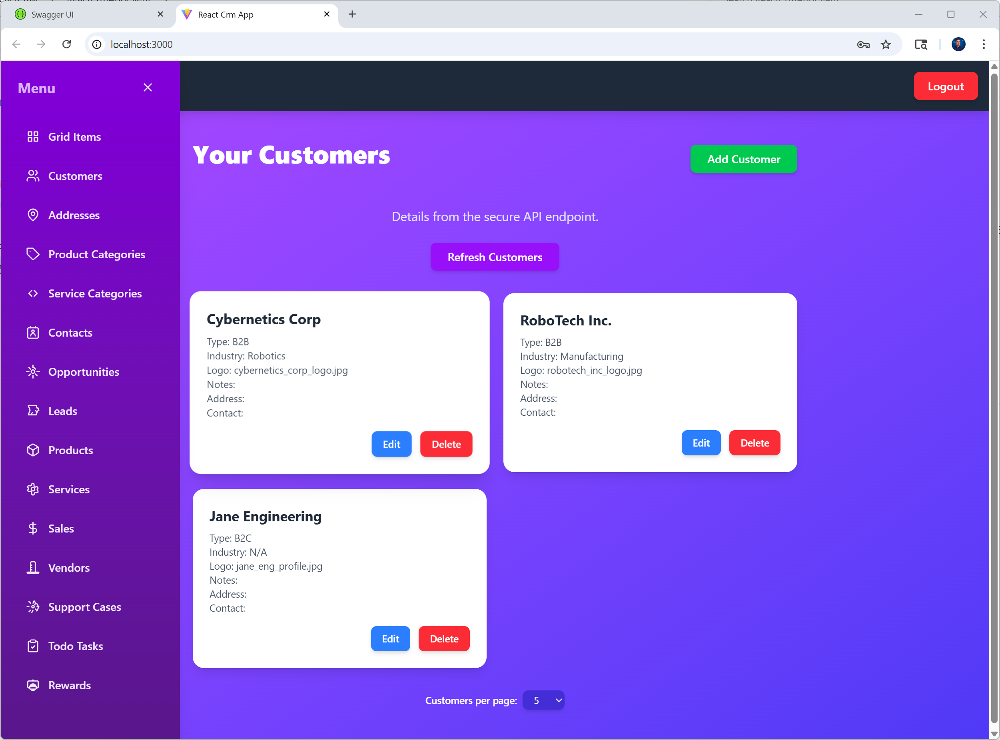
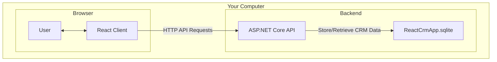

# 📚 React CRM

**React CRM** is a fully self-contained, flexible CRM application that lets you organize and manage various business entities and relationships locally. No data ever leaves your machine.

It features a clean, modern React frontend built with Vite and styled with Tailwind CSS, plus a robust ASP.NET Core backend powered by Entity Framework Core for data management.



## ✨ Core Features

*   **100% Local & Offline**: Your sensitive CRM data never touches the internet.
*   **Flexible Entity Management**: Add, edit, and organize your core business records (e.g., leads, contacts, customers, products, vendors, ETC).
*   **Relationship Mapping**: Define and manage complex relationships between different types of entities.
*   **Customizable Organization**: Organize all records with flexible tags, categories, or statuses for powerful filtering and workflow management.
*   **Many-to-Many Support**: Full support for many-to-many relationships between different types of entities.
*   **Modern Web UI**: A responsive and intuitive interface built with React, Vite, and Tailwind CSS.
*   **Persistent Storage**: Uses EF Core and a local SQLite database to store all your CRM data.

## 🏛️ Architecture

The project is architected with a clean separation between the frontend client and the backend API, enabling scalability and maintainability.



## 🛠️ Technology Stack

| Area       | Technology              | Purpose                                                      |
| :--------- | :---------------------- | :----------------------------------------------------------- |
| **Frontend** | React + Vite            | Rich, interactive JavaScript-based web UI with fast development. |
|            | Tailwind CSS            | Utility-first CSS framework for rapid UI development.        |
| **Backend**  | ASP.NET Core 9 Web API  | High-performance API for handling business logic.            |
|            | C# 12                   | Modern, powerful language for the backend.                   |
| **Database** | Entity Framework Core 9 | ORM for interacting with the database.                       |
|            | SQLite                  | Lightweight, serverless, file-based database for local storage. |

## ✅ Prerequisites

Before you begin, ensure you have the following installed:

1.  **.NET 9 SDK**: [Download here](https://dotnet.microsoft.com/download/dotnet/9.0)
2.  **Node.js and npm**: [Download here](https://nodejs.org/) (Required for React, Vite, and Tailwind CSS)

## ⚙️ Setup and Running Instructions

Follow these steps to get the application running locally.

### 1. Clone the Repository

```bash
git clone https://github.com/donpotts/ReactCRM.git
cd ReactCrm
```

### 2. Run the Backend Server (`ReactCrmApp`)

The backend must be running before you start the frontend.

```bash
# Navigate to the server project directory
cd ReactCrmApp

# Restore dependencies
dotnet restore

# Apply database migrations. This creates and seeds the ReactCrmApp.sqlite file.
dotnet ef database update

# Run the server
dotnet run
```

The API will now be running, typically at `https://localhost:7216`.

### 3. Run the Frontend Client (`ReactCrmAppClient`)

Open a **new terminal window** for this step.

```bash
# Navigate to the client project directory
cd ReactCrmAppClient

# Install Node.js dependencies for React, Vite, and Tailwind CSS
npm install

# Run the Vite development server
npm run dev
```

Your default browser should open to the application, typically at `http://localhost:5173`.

## 📖 How to Use

1.  **Launch the App**: Once the client and server are running, the web UI will load.
2.  **Login with default user**: Once authenicated the hamburger navigation is enabled.
3.  **Browse Your Records**: Using the sidenav to select the entity to view, edit or delete.
4.  **Add New Entries**: Use the "Add" buttons to create new records for your various entities.

## 📂 Project Structure

The solution is organized into three distinct projects for a clean separation of concerns:

```
/
├── ReactCrmAppClient/  # The React + Vite frontend project and all UI components.
├── ReactCrmApp/        # The ASP.NET Core Web API, services, data models, and database logic.
└── ReactCrmApp.Shared/ # A class library for DTOs shared between the client and server.
```

---

**NOTE: This project is designed to run entirely on your local machine for complete privacy and control of your personal CRM data. It does not require any cloud services or external APIs.**

## 📞 Contact

For any questions, feedback, or inquiries, please feel free to reach out.

**Don Potts** - [Don.Potts@DonPotts.com](mailto:Don.Potts@DonPotts.com)